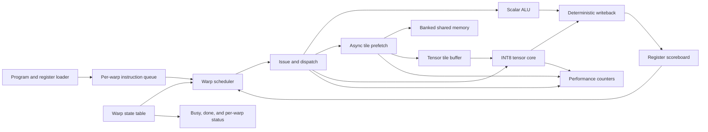
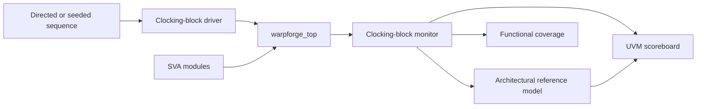

# WarpForge

WarpForge is a simplified transformer-oriented GPU Streaming Multiprocessor
written in synthesizable SystemVerilog. It integrates SIMT-style warp
scheduling, register dependency tracking, warp lifecycle control, banked
shared memory, queued tile prefetch, scalar execution, signed INT8 tensor
matrix multiplication, and architecture performance counters.

The project is an educational and research-style architecture model. It runs
small tiled kernels and toy inference workloads; it is not a production GPU
and does not claim support for full GPT, BERT, Llama, or other large models.

## Motivation

Transformer accelerators are not only matrix multipliers. Their performance
depends on scheduling, dependency management, data movement, memory banking,
latency tolerance, and resource arbitration. WarpForge makes those
interactions visible in a compact project that can be simulated, verified,
and discussed at the RTL and microarchitecture levels.

## Difference between this and a generic CPU

WarpForge is not a general-purpose CPU and does not implement the RISC-V ISA.
It uses a compact custom instruction format built around warp scheduling,
asynchronous tile movement, scalar bookkeeping, and tensor operations. The
design emphasis is GPU-style control and dataflow rather than branch-heavy
single-thread execution, privilege modes, caches, or a software ecosystem.

## Current Status

The integrated SM, UVM environment, direct tests, regression scripts,
assembler, workload generators, performance extraction, and CI definitions
are implemented. On June 11, 2026, the local ModelSim Intel FPGA Starter 20.1
flow passed 22 representative unit, UVM, and workload targets with seed 17.
Nine Python tooling tests and all three software reference workloads also
passed.

ModelSim Starter compiled coverage-enabled UVM source but cannot execute user
covergroups, native constrained randomization, or concurrent assertions under
its license. No functional coverage percentage is claimed. No synthesis,
timing, power, FPGA utilization, or silicon result is claimed.

On June 13, 2026, a separate Verilator 5.020 audit passed all 13 direct
simulation targets and 1,300 repeated binary executions. It also identified
and fixed barrier gating, tree-mode handshake, duplicate-prefetch, parameter
indexing, and tensor accumulator-width defects. See the
[audit report](docs/audit_report_2026-06-13.md) for the complete findings and
limitations.

## Architecture



One current instruction is exposed for each warp. The scheduler filters
inactive, completed, dependency-stalled, tile-stalled, tensor-stalled, and
prefetch-stalled warps. An accepted instruction advances only the selected
warp PC. Scalar and tensor destinations are marked busy until writeback.

See [architecture.md](docs/architecture.md) and
[microarchitecture.md](docs/microarchitecture.md) for detailed behavior.

## Module Hierarchy

```text
warpforge_top
|-- instruction_queue
|-- scalar_register_file
|-- scoreboard
|-- warp_state_table
|-- warp_scheduler
|-- warpforge_issue_control
|-- warpforge_run_control
|-- scalar_alu
|-- tensor_core
|   |-- tensor_core_tree
|   `-- tensor_core_pipelined_tree
|-- tensor_tile_buffer
|-- async_tile_prefetch
|   `-- fifo
|-- shared_memory
|   `-- ram_sdp per bank
`-- perf_counters
```

Reusable infrastructure also includes `skid_buffer` and `valid_pipeline`.

## Top-Level Interface

`warpforge_top` exposes:

- Reset, clear, start, and scheduler-policy controls
- Per-warp instruction load and scalar-register load ports
- Word-addressed global-memory request and response channels
- Busy, done, per-warp done, and per-warp error status
- Issue, scalar-result, tensor-result, and tile-valid debug outputs
- A packed snapshot of all architecture performance counters

Programs and initial register values are loaded before `start`. `clear`
restarts loaded programs while clearing execution state. Full interface
semantics are documented in [architecture.md](docs/architecture.md).

## Instruction Set

| Instruction | Behavior |
| --- | --- |
| `NOP` | Advance without executing a unit. |
| `ALU_ADD` | `dst = src0 + src1`. |
| `ALU_MUL` | `dst = low_width(src0 * src1)`. |
| `ALU_MAD` | `dst = low_width(src0 * src1 + src2)`. |
| `PREFETCH_TILE` | Queue a warp-local packed tensor tile transfer. |
| `WAIT_TILE` | Stall until the selected tile is valid. |
| `TENSOR_MMA` | Execute signed tiled matrix multiplication. |
| `BARRIER` | Wait for all launched nonterminal warps. |
| `END` | Complete the selected warp. |
| `ILLEGAL` | Enter warp error state and count the error. |

The default packed instruction width is 42 bits. See
[instruction_set.md](docs/instruction_set.md) for field positions and
assembler syntax.

## Scheduler Policies

- `SCHED_ROUND_ROBIN`: starts at a rotating pointer and advances after an
  accepted issue.
- `SCHED_GREEDY`: chooses the lowest-numbered ready warp.
- `SCHED_MEMORY_AWARE`: first limits greedy selection to ready tensor warps
  whose tile is valid, then falls back to ordinary ready warps.

The current memory-aware policy is deliberately simple. The checked two-warp
comparison ties across all policies, so no performance advantage is claimed.
See [scheduler.md](docs/scheduler.md).

## Scoreboard And Warp State

The scoreboard tracks one busy bit per warp and scalar register. Sources or a
busy destination block issue. Writeback clear wins over same-cycle set for the
same register, which exposes a completed value without leaving a stale busy
bit. Optional same-cycle scalar forwarding is controlled by
`ENABLE_OPERAND_FORWARDING` and is disabled by default.

Warp states are `IDLE`, `ACTIVE`, `WAIT_SCOREBOARD`, `WAIT_TILE`,
`WAIT_TENSOR`, `WAIT_BARRIER`, `DONE`, and `ERROR`. Error and done updates
have priority over activation and wait-state classification.

## Tensor Core

The default operation is signed INT8 `4 x 4 x 4` matrix multiplication with
signed INT32 accumulation. A tile stores matrix A followed by matrix B in
row-major order.

Two implemented modes are available:

- `TENSOR_ARCH_TREE`: balanced combinational reduction with a one-entry
  elastic output register
- `TENSOR_ARCH_PIPELINED_TREE`: elastic product and reduction stages

The pipelined tree is the default and accepts one operation per cycle when
unstalled. `TENSOR_ARCH_SYSTOLIC` is reserved and fails elaboration rather
than silently selecting another architecture. See
[tensor_core.md](docs/tensor_core.md).

## Shared Memory And Prefetch

Shared memory instantiates one portable simple dual-port RAM wrapper per bank.
Low address bits select the bank and high bits select the row. Different-bank
requests proceed together; same-bank conflicts use deterministic lowest-port
priority and count denied requests.

The prefetch engine queues warp ID, tile ID, global base word address, shared
base address, and length. It transfers one word at a time through valid/ready
channels and marks a tile valid only after the final shared-memory write is
accepted. Duplicate pending requests wait for the original transfer; a
program-level prefetch of an already-valid tile retires as an idempotent
no-op. The engine itself rejects duplicate pending or valid requests unless
overwrite is enabled. See [shared_memory.md](docs/shared_memory.md) and
[prefetch_engine.md](docs/prefetch_engine.md).

## Performance Counters

Counters include cycles, issued/scalar/tensor/prefetch instructions,
scheduler/scoreboard/tile/tensor/prefetch stalls, tensor busy/accepted/
completed activity, bank conflicts, prefetch requests/stalls, completed
warps, and illegal instructions.

`tools/collect_perf.py` extracts `WARPFORGE_PERF` records from logs and writes
CSV. Tensor busy-cycle utilization is:

```text
100 * tensor_busy_cycles / total_cycles
```

See [performance_counters.md](docs/performance_counters.md) and
[results.md](docs/results.md).

## Verification



The UVM reference model tracks loaded instructions, per-warp PCs, scalar
registers, busy state, prefetched tile words, tile validity, scalar results,
tensor results, terminal state, and basic counter sanity. The scoreboard
compares scalar writeback, full tensor matrices, and warp completion/error
events.

Clocking blocks separate drive and sample regions. Tests avoid `#0`, process
ordering assumptions, and multiple drivers. Random tests print and accept a
seed. A watchdog terminates deadlock.

### Assertions

Nine SVA bind modules cover scheduler legality, scoreboard state, tensor
latency and stability, shared-memory conflicts, prefetch queue and tile state,
instruction PC behavior, scalar handshake behavior, counter monotonicity, and
top-level issue/completion invariants. Concurrent assertions were compiled
but not executed by the local Starter Edition license.

### Functional Coverage

The current UVM covergroup samples observation kind, opcode, scheduler policy,
warp ID, negative result, zero result, and policy-by-opcode cross coverage.
Coverage source compiles when coverage is enabled. Queue-depth, bank-conflict,
and detailed warp-state covergroups remain future expansion, and no coverage
percentage is reported.

### Test Suites

Direct self-checking benches cover:

- Scoreboard dependencies and simultaneous set/clear
- Scheduler policy selection and barrier eligibility filtering
- Tensor positive, signed, zero, extreme, back-to-back, backpressure, reset,
  both architectures, and `K = 1, 3, 5` parameter limits
- Shared-memory banking, conflicts, read-after-write, and reset
- Prefetch transfer, full queue, backpressure, reset, and idempotent
  already-valid tile handling
- Instruction queue, scalar ALU, and performance counters
- Integrated top-level execution, barrier/prefetch control boundaries, and
  file-driven GEMM with both tensor architectures

Integrated UVM tests cover scheduler policies, single- and multi-warp
execution, barriers, reset recovery, illegal instructions, variable memory
latency, memory backpressure, seeded scalar programs, and long four-warp
programs. The complete public test mapping is in `sim/test_manifest.csv`.

## Running Tests

### ModelSim Intel FPGA Starter

```powershell
.\sim\scripts\run_modelsim.ps1 -Test sanity_smoke_test -Seed 17
.\sim\scripts\run_modelsim.ps1 -Test workload_gemm_test -Seed 17
.\sim\scripts\run_modelsim.ps1 -Test all -Seed 17 -Quiet
```

The checked full command runs 22 representative targets. It uses a
deterministic LFSR fallback and disables covergroups for Starter compatibility.

### Questa

```bash
UVM_HOME=/path/to/uvm-1.2/src \
TEST=constrained_random_instruction_test \
SEED=17 \
./sim/scripts/run_questa.sh

UVM_HOME=/path/to/uvm-1.2/src \
SEED=17 \
./sim/scripts/run_regression.sh
```

VCS and Xcelium entry points are provided in `sim/scripts`, but were not run
in the local environment. See [regression.md](docs/regression.md).

### Verilator

```bash
./sim/scripts/run_verilator_regression.sh
```

This builds and runs all 13 direct targets in isolated build directories.
The June 13, 2026 audit also repeated every generated simulation binary 100
times.

### Python Tools

```bash
python -B -m unittest discover -s tools -p "test_*.py"
python tools/assembler.py program.asm -o program.hex
python tools/generate_gemm_program.py workloads/gemm --seed 17
```

## Workload Demos

- `workloads/gemm`: RTL-executed signed INT8 4x4 GEMM with Python and
  file-based golden results
- `workloads/mnist_mlp`: deterministic 64x16x10 integer MLP reference
- `workloads/tiny_transformer`: four-token, 16-dimension integer `QK^T` and
  scores-times-V reference

The MLP and transformer demos validate data preparation and golden arithmetic.
They are not yet lowered into WarpForge tile programs. Softmax is omitted from
the transformer demo. See [workloads.md](docs/workloads.md).

## Measured Simulation Results

The checked ModelSim seed-17 GEMM completed in 32 counted cycles with one
tensor operation, one prefetch, no bank conflicts, and 9.375 percent tensor
busy-cycle utilization.

The Verilator audit reproduced the pipelined result and ran the same workload
with tree mode. Tree mode completed in 30 counted cycles with one tensor-busy
cycle; this is an architectural simulation comparison, not a timing or area
result.

The round-robin, greedy, and memory-aware scheduler smoke runs each completed
in 40 counted cycles with 33 aggregate tile-wait cycles and 7.5 percent tensor
busy-cycle utilization. This small workload validates counter and policy
selection, but does not show a scheduling advantage. CSV files are in
`results/`.

## Parameterization

Defaults are centralized in `warpforge_pkg.sv`, including warp/register/tile
counts, instruction depth, shared-memory geometry, prefetch depth, tensor
dimensions and widths, and counter width.

To change tensor dimensions, update `TENSOR_M`, `TENSOR_N`, and `TENSOR_K`,
then regenerate tile data and rerun tensor, prefetch, top, and workload tests.
The shared-memory capacity and maximum prefetch length elaboration checks must
still pass. `TENSOR_ACC_WIDTH` must be at least
`2 * TENSOR_INPUT_WIDTH + ceil(log2(TENSOR_K))`.

To change the number of warps, update `NUM_WARPS` and rerun scheduler,
scoreboard, state-table, top, UVM, and long-random tests.

To add an instruction, update the package enum and opcode helper functions,
assembler map/parser, issue decode, execution/writeback behavior, reference
model, coverage, assertions, and directed tests.

## Known Limitations

- No cache hierarchy, coalescer, register-file banking, divergence stack, or
  reconvergence mechanism
- One instruction issue per cycle and one global barrier domain without
  barrier IDs or independent barrier generations
- One packed A/B tile operand per tensor instruction
- Only matrix element `[0][0]` is written into the scalar register file;
  the full matrix is exposed on the result interface
- Systolic tensor mode is reserved but not implemented
- Memory-aware scheduling uses tile-ready priority only
- MLP and transformer examples are not compiled into RTL programs
- No coverage percentage from a coverage-capable simulator
- No formal proof or commercial-simulator UVM/assertion run from the June 13
  audit environment
- No synthesis, timing closure, power, area, FPGA, or silicon data

## Future Work

Priority extensions include an iterative or systolic tensor mode, richer
memory-aware scheduling, split A/B tile operands, architectural tensor result
storage, operand-forwarding performance studies, workload tiling/runtime
support, deeper coverage, formal checks, and measured FPGA synthesis.

See [future_work.md](docs/future_work.md).


## Repository Layout

```text
rtl/         Synthesizable SystemVerilog
tb/          Direct tests, UVM environment, interface, and assertions
sim/         Filelists and simulator/regression scripts
tools/       Assembler, generators, quantization, and performance extraction
workloads/   GEMM, reduced MLP, and tiny attention demos
results/     Simulation-derived CSV examples
docs/        Architecture, verification, workload, and results documentation
```

## Methodology And License

The RTL follows the
[ARC-Lab-UF SystemVerilog tutorial](https://github.com/ARC-Lab-UF/sv-tutorial)
style: explicit circuit structure, `always_ff` for sequential logic,
`always_comb` for combinational logic, nonblocking clocked assignments,
parameter checks, controlled resets, and timing-aware reduction structures.

WarpForge is maintained by Sanat Konda and released under the MIT License.
