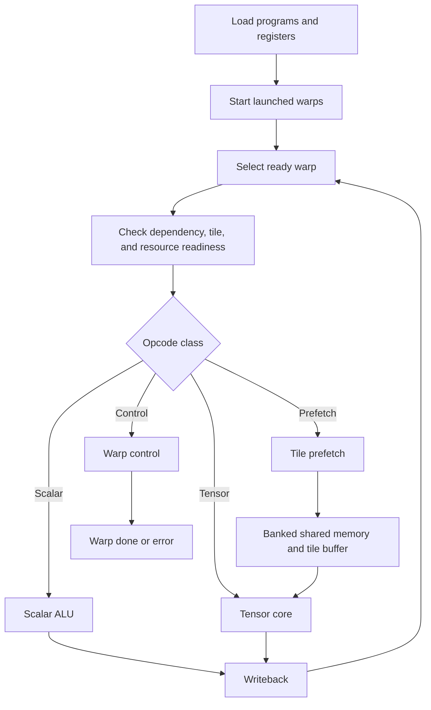

# Architecture

WarpForge models one simplified GPU Streaming Multiprocessor with multiple
resident warps and shared scalar, tensor, and memory resources.

## Execution Flow

1. Verification software loads instructions and optional scalar register data.
2. `start` captures every warp with a valid instruction at PC zero.
3. The scheduler selects one legal warp.
4. Issue control checks dependencies, tile readiness, and downstream capacity.
5. An accepted instruction advances only that warp's PC.
6. Scalar or tensor destinations enter the scoreboard.
7. Prefetch requests move packed tile words into shared memory and the tensor
   tile buffer.
8. Scalar and tensor writeback clear scoreboard entries.
9. `END` or an illegal opcode makes the warp terminal.
10. `done` asserts after every launched warp is terminal and all work drains.

## Top-Level Control Interface

`rst` clears loaded instructions and all execution state. `clear` preserves
loaded instruction memory but restarts PCs, registers, scoreboards, queues,
valid state, counters, and warp control. `start` is a pulse and is ignored
while launch sequencing is already active.

Instruction load uses `load_valid/load_ready`, warp ID, instruction address,
and packed `instruction_t`. Scalar initialization uses a separate
`reg_load_valid/reg_load_ready` channel.

## Global Memory Interface

The prefetch engine emits word-addressed `global_req_valid`,
`global_req_ready`, and `global_req_addr`. One response word returns through
`global_rsp_valid`, `global_rsp_ready`, and `global_rsp_data`. The model
supports at least one cycle between request acceptance and response validity.

This interface is intentionally smaller than AXI and is intended for
microarchitecture verification.

## Status And Results

`busy` includes launched warp activity and outstanding scalar, tensor,
scoreboard, and prefetch work. `done` is valid only after a nonempty launch.
Per-warp done and error vectors identify terminal status.

Issue debug identifies the accepted instruction and warp. Scalar result debug
reports one register writeback. Tensor result debug reports the full matrix,
warp ID, and destination. Tensor writeback also places matrix element `[0][0]`
in the scalar register file.

## Deterministic Priorities

- Warp error beats done, activation, and wait-state updates.
- Warp done beats activation and wait-state updates.
- Barrier wait beats tensor, tile, and scoreboard wait classification.
- Tensor writeback beats scalar writeback when both are available.
- Shared-memory arbitration gives the lowest numbered requester priority.
- Scoreboard clear wins over set for the same register in one cycle.

These rules keep same-cycle behavior testable and independent of simulator
process ordering.
